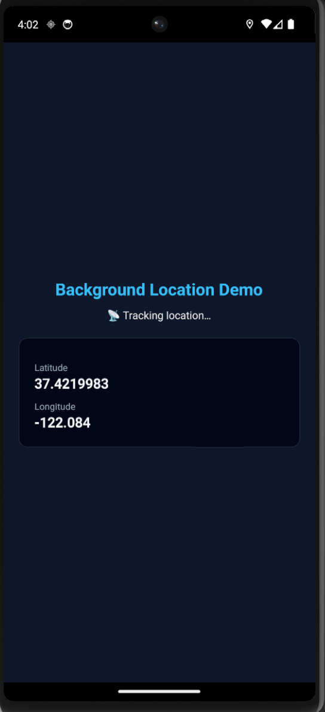
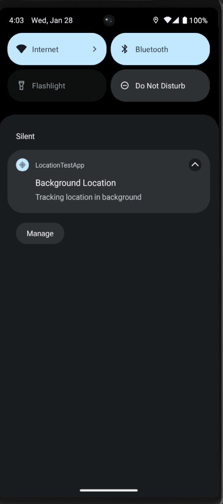

react-native-find-background-location-vd

📍 Android foreground-service based background location tracking for React Native

This library provides reliable background location updates on Android using a foreground service, fully compatible with Android 10 → Android 14+.

✅ Android only

## ⚠️ Android Kill-Mode Behavior

Android does NOT guarantee background execution after the user force-closes
the app (swipe away from recent apps).

This library uses a **foreground service**, which:
- ✅ Works in background
- ✅ Works with screen off
- ✅ Works when app is minimized
- ❌ May stop when app is swiped away (system decision)

This is expected Android behavior and applies to all apps, including
Google Maps and Uber, depending on device and OEM settings.

📦 Installation
npm install react-native-find-background-location-vd

or

yarn add react-native-find-background-location-vd

Autolinking is supported. No manual linking required.

⚠️ Android Permissions (REQUIRED)

Add the following permissions to your app AndroidManifest.xml:

<uses-permission android:name="android.permission.ACCESS_FINE_LOCATION" />
<uses-permission android:name="android.permission.ACCESS_COARSE_LOCATION" />
<uses-permission android:name="android.permission.ACCESS_BACKGROUND_LOCATION" />

<uses-permission android:name="android.permission.FOREGROUND_SERVICE" />
<uses-permission android:name="android.permission.FOREGROUND_SERVICE_LOCATION" />

<!-- Android 13+ -->
<uses-permission android:name="android.permission.POST_NOTIFICATIONS" />

⚠️ Android 14+ requires FOREGROUND_SERVICE_LOCATION
Missing it will cause the app to crash immediately.

🚀 Usage
Basic example
import { useEffect } from 'react';
import {
  startLocation,
  stopLocation,
  onLocation,
} from 'react-native-find-background-location-vd';

useEffect(() => {
  const subscription = onLocation(location => {
    console.log(
      '📍 LOCATION:',
      location.latitude,
      location.longitude
    );
  });

  startLocation();

  return () => {
    stopLocation();
    subscription.remove();
  };
}, []);

🔐 Request Permissions (IMPORTANT)

You must request runtime permissions before starting location tracking.

import { PermissionsAndroid, Platform } from 'react-native';

export async function requestLocationPermissions() {
  if (Platform.OS !== 'android') return true;

  const fine = await PermissionsAndroid.request(
    PermissionsAndroid.PERMISSIONS.ACCESS_FINE_LOCATION
  );

  if (fine !== PermissionsAndroid.RESULTS.GRANTED) return false;

  if (Platform.Version >= 29) {
    const bg = await PermissionsAndroid.request(
      PermissionsAndroid.PERMISSIONS.ACCESS_BACKGROUND_LOCATION
    );
    if (bg !== PermissionsAndroid.RESULTS.GRANTED) return false;
  }

  return true;
}

👉 Call startLocation() only after permissions are granted.

🔔 Foreground Notification

Android requires a persistent notification while tracking location.

This library automatically shows:

Background Location
Location tracking is active

⚠️ Users cannot hide this notification (Android system rule).

🔋 Battery Optimization (Recommended)

For reliable background tracking, ask users to disable battery optimization:

Settings → Battery → Battery Optimization
→ Your App → Don’t optimize

🏪 Play Store Policy Notice

If you publish an app using this library:

You must declare background location usage

You must justify foreground service

You must show user disclosure

You must allow opt-out

Failure to comply may result in Play Store rejection.

❌ iOS Support

This library does NOT support iOS background location.

iOS code is a stub only

No CoreLocation integration

This repository includes a fully working example app:

cd example
yarn android

🤝 Contributing

Development workflow

Sending a pull request

Code of conduct

Android only
Install app

Grant permissions

Tap Start Location

Show notification

Lock screen → still logs location

Minimize app → still logs

Swipe app away → explain limitation on screen
🧪 Example App

Demo App Flow

📄 License

MIT

👨‍💻 Maintained by

Vijay Dhakad

Built with ❤️ using
create-react-native-library